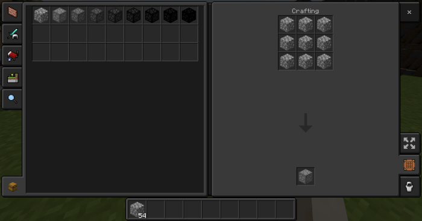
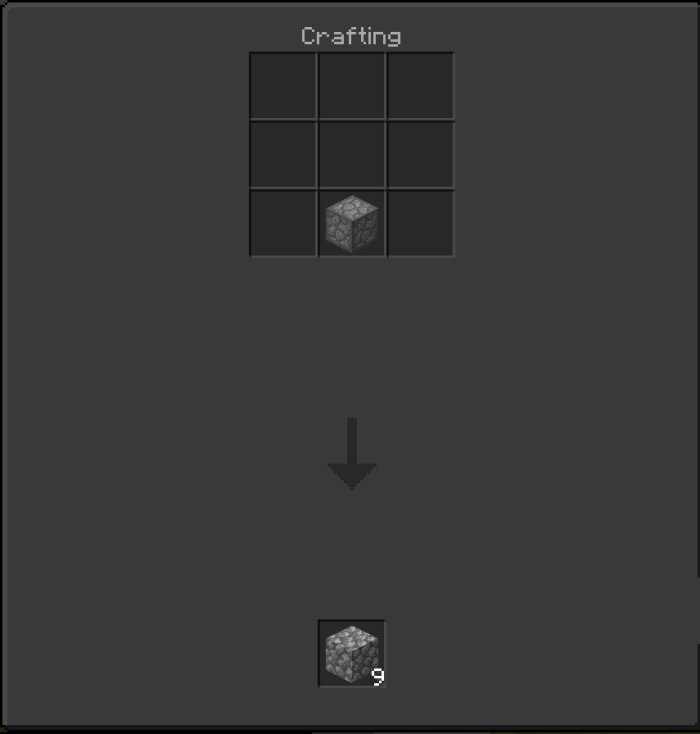

# Compressed Cobblestone


With this addon, anyone will be able to compress of cobblestone into the 8 new blocks that allow for an easier form to carry.

This was inspired by the original mod in Minecraft: Java Edition called [Extra Utilities](https://ftbwiki.org/Extra_Utilities).

The next ‘tier’ of each Compressed Cobblestone is nine of the lower ‘tier’ in a crafting grid.

These are the name of the compressed cobblestone:
- Compressed Cobblestone (9 Cobblestone)
- Double Compressed Cobblestone (81 Cobblestone)
- Triple Compressed Cobblestone (729 Cobblestone)
- Quadruple Compressed Cobblestone (6,561 Cobblestone)
- Quintuple Compressed Cobblestone (59,049 Cobblestone)
- Sextuple Compressed Cobblestone (531,441 Cobblestone)
- Septuple Compressed Cobblestone (4,782,969 Cobblestone)
- Octuple Compressed Cobblestone (43,046,721 Cobblestone)

To craft these new blocks, you just fill up the whole crafting table



To uncraft these new blocks, you just place one anywhere on the crafting table and it goes the next lower ‘tier’



You can also use a command to bypass creating all these by hand. (# equals any number)

```txt
/give @s cc:cc_#
```

For more information visit the [wiki](https://ftbwiki.org/Compressed_Cobblestone_(Extra_Utilities)) or check it out the [GitHub](https://github.com/PiSaucer/MiniExtraUtilities).

## Acknowledgments
Original author: [CoinRaptor7111](https://mcpedl.com/user/coinraptor7111/) on [mcpedl.com](https://mcpedl.com/compressed-cobblestone-addon/)

I tweak some of the code and retexture the blocks.
